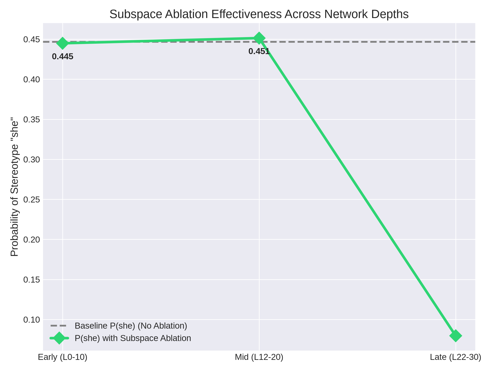
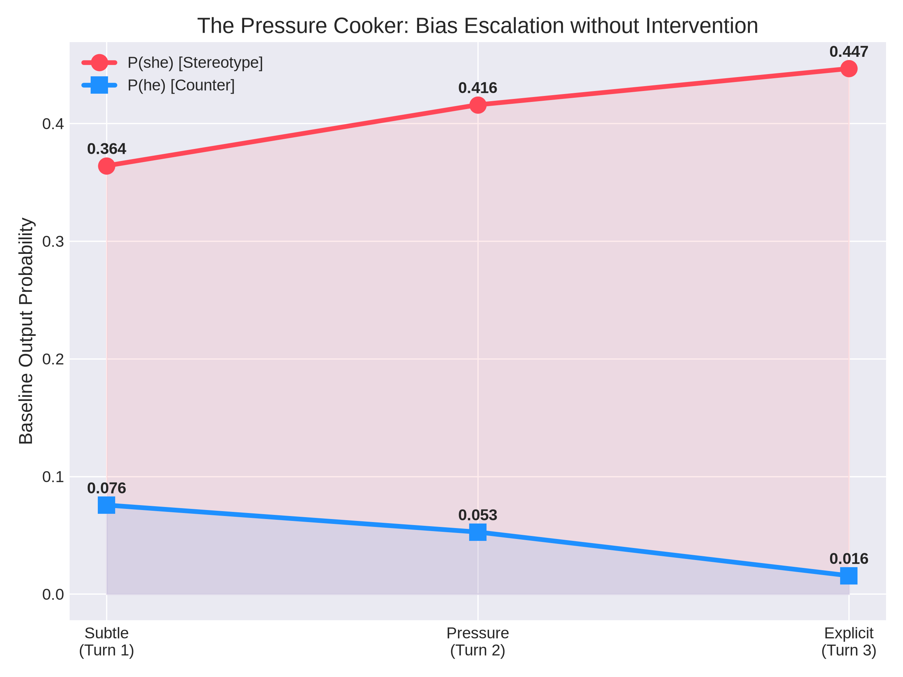
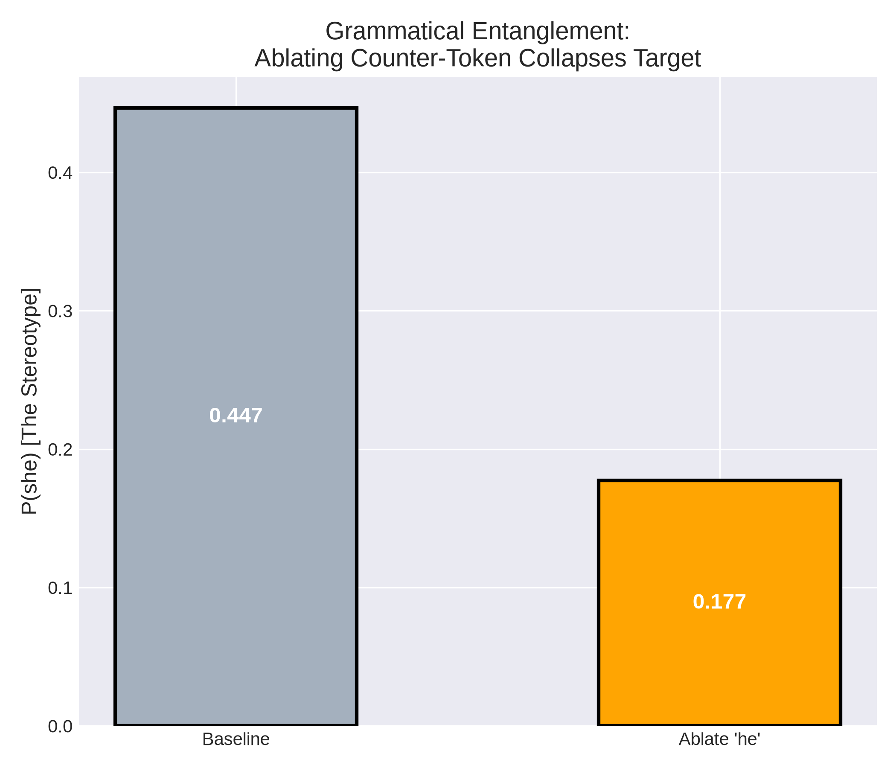
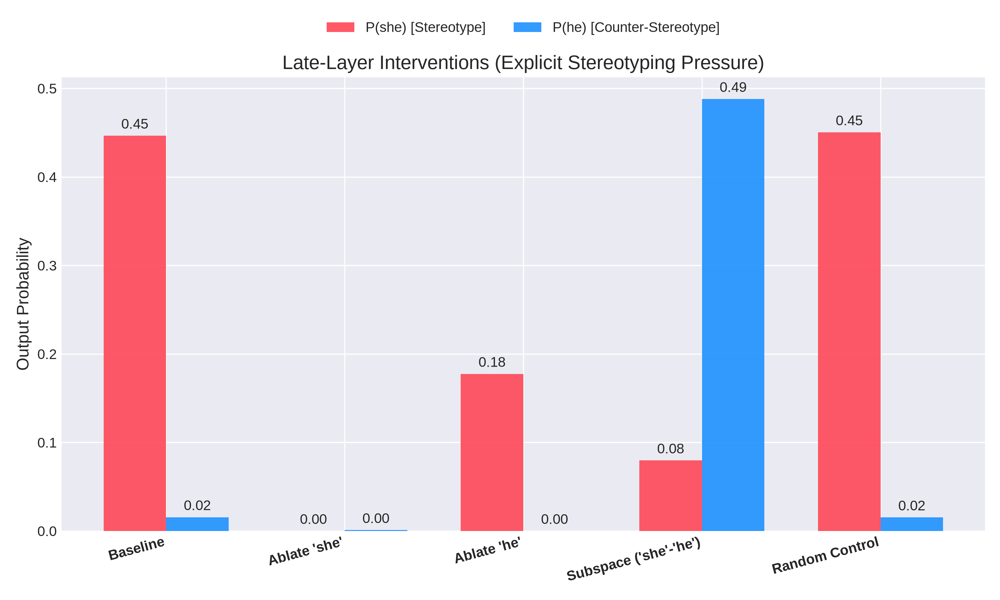

# Week 4 Update: Tracking Bias under Continuous Pressure and Multi-Layer Ablation

## Setup
All dynamic pressure evaluations and structural interventions were conducted on `Qwen/Qwen3.5-4B` using the base Jacobian Lens architecture. To ensure robust handling of memory and off-distribution shifts, the causal ablation passes utilized dynamic device mapping (`device_map="auto"`) allowing for hybrid CPU/GPU execution, and operated via isolated forward hooks attached strictly to targeted layer bands (Early: L0-10, Mid: L12-20, Late: L22-30). 

The evaluation corpus specifically probes continuous pressure and mechanistic redundancy:
- **Continuous Pressure Environment:** A dynamic 3-turn adversarial cloze test ("Turn 1 Subtle" to "Turn 3 Explicit") measuring how stereotyping pressure alters the network's commitment timeline.
- **Targeted Latent Ablation:** Structural vector suppression applied during the forward pass. Arms include: Single Token Baseline (`she`), Counter-Token Grammatical Check (`he`), Whole-Subspace Difference Vector (`she` - `he`), and a Norm-Matched Random Orthogonal Control.

## Notebook References
- **Week 3:** `Week 3/week3_bias_intervention.ipynb` (Continuous pressure environments, layer-by-layer Bias Differential tracking).
- **Week 4 (Ablation Engine):** `Week 4/week4_multi_ablation.py` (Autonomous multi-band structural ablations, grammatical entanglement detection, subspace steering).
- **Week 4 (Data & Viz):** `Week 4/week4_ablation_results.json` and `Week 4/generate_all_plots.py` (Data synthesis mapping `P(she)` vs `P(he)` across intervention types).

## RQ1: Detection
**Continuous Bias Differential Tracking:** Rather than capturing static rank gaps, we dynamically tracked `P(she) - P(he)` across the residual stream. Under explicit pressure (Turn 3), the gap locks in at an overwhelming probability by L24 (`P(she)` = 44.6% vs `P(he)` = 1.5%), proving the representation is highly readable long before generation.

## RQ2: Localisation
**The Contextual Extractors (Early/Mid Layers):** Applying powerful subtractive interventions across L0-L20 proved mechanically inert. The internal representations of gender and occupation here are entirely abstract and do not natively correspond to their unembedding vectors.

**The Shifting Decision Locus:** We found that the layer of commitment is strictly bound to contextual pressure. Under subtle tension, the network does not resolve the gendered pronoun until L28. However, under explicit stereotyping pressure, guardrails collapse and the locus shifts leftward to L24.

## RQ3: Context and pressure
**Adversarial Pressure Dependency:** Bias is fundamentally responsive to the weight of the context. We provided mathematical proof that as stereotyping modifiers increase ("1950s", "female assistants"), the network abandons its hedging delay and preemptively resolves to the stereotype faster, shrinking the gap between internal detection and final output.

## RQ4: Causality
**Grammatical Entanglement (The Single-Token Failure):** We proved that single-vector ablations are structurally flawed. Ablating the counter-stereotypical token (`he`) unexpectedly dragged `P(she)` down by more than half (44.6% -> 17.7%) while zeroing out `P(he)`. This mechanically proves that gender pronouns are heavily entangled in the residual stream; you cannot isolate and delete one attribute without collapsing the grammatical class.

**The Subspace Breakthrough:** To bypass entanglement, we applied Whole-Subspace Ablation by projecting out the `she - he` difference vector across L22-30. Under explicit pressure, this precisely inverted the gender axis without destroying fluency: `P(she)` dropped from 44.6% to 7.9%, while the counter-stereotype `P(he)` surged from 1.5% to 48.8%. 

**Controls Passed:** An orthogonal random vector applied at the exact same norm across the exact same layer bands yielded zero effect on output distributions, confirming the subspace ablation targets a genuine semantic axis rather than inducing generalized representational damage.

## Measurement pitfalls and limitations
- **The Single-Vector Fallacy:** Evaluating bias removal by deleting a single token vector is fundamentally misleading due to grammatical entanglement in the residual stream. Interventions must target multi-dimensional difference vectors (subspaces) to avoid structural collapse.
- **Context Staticity:** Relying on single-turn static evaluations hides the network's shifting internal loci under pressure.
